# Hi there, I'm Sid 👋

**化繁為簡，讓工具回到「幫你省事」這件事本身。**

**Simplify complexity. Make tools work for you, not the other way around.**

我是一名獨立開發者，專注於桌面自動化、流程優化與實用型網頁工具。擅長將重複繁瑣的操作壓縮成一鍵式解決方案，從需求到釋出完整負責。

I'm an independent developer focused on desktop automation, workflow optimization, and practical web tools. I specialize in compressing repetitive tasks into one-click solutions — owning the full cycle from idea to release.

---

## 📊 GitHub Stats

  
  

  

---

## 🛠️ Tech Stack

| Category | Technologies |
|----------|-------------|
| **Languages** |    |
| **Vision & Automation** |   RapidOCR · mss · NumPy |
| **Web** |   Canvas API |
| **Frameworks & Tools** |   TCP Socket · PyInstaller |

---

## 📌 Featured Projects

### Desktop Automation / 桌面自動化

---

#### 🖥️ HealthMonitor
`Python` `OpenCV` `Multi-threading` `GUI`

Path of Exile 2 即時狀態監控與自動化操作系統。基於圖像識別，透過螢幕擷取與模擬輸入與目標應用互動，不讀取記憶體或修改檔案。

Real-time HP/MP monitoring and automation system for Path of Exile 2. Uses image recognition via screen capture and simulated input — no memory reading or file modification.

- 血量/魔力即時監控，多閾值自動觸發 / Multi-threshold HP/MP auto-trigger
- 自訂技能連段 / Custom skill combos with configurable timing
- 一鍵清包與取物 / One-click inventory clearing and item pickup
- 全域暫停與熱鍵管理 / Global pause and hotkey management

🔗 [HealthMonitor](https://github.com/Sid-1996/PathofExile-Sid-GameTools_HealthMonitor) ⭐10

---

#### 🖥️ Sid-Exile-Toolbox
`AutoHotkey v1` `4000+ lines` `8 years`

PoE1 多功能工具箱。歷經八年迭代、超過 4000 行原始碼，整合視窗偵測、圖像識別、熱鍵管理與多種流程控制。已全面開源。

A comprehensive PoE1 automation toolkit with 8 years of iteration and 4000+ lines of code. Features window detection, image recognition, hotkey management, and flow control. Fully open-sourced.

- 視窗狀態偵測與條件觸發 / Window state detection and conditional triggers
- 一鍵喝水、清包、返角 / One-click flask, inventory clear, and logout
- 技能連段與自動化流程 / Skill combos and automated workflows
- 模組化設定檔管理 / Modular profile configuration

🔗 [Sid-Exile-Toolbox](https://github.com/Sid-1996/Sid-Exile-Toolbox) ⭐1

---

#### 🖥️ AetherGazer-SemiAuto-AHK
`AutoHotkey v2` `Image Recognition` `Modular Architecture`

深空之眼半自動輔助專案。模組化工程架構，獨立的座標校正工具，透過圖片模糊匹配強化辨識穩定性。

Semi-auto assistant for Aether Gazer. Modular project structure with standalone coordinate calibration and fuzzy image matching for robust recognition.

- 模組化架構 (src/config/assets/docs) / Modular project structure
- 圖像模糊匹配與參數調校 / Fuzzy image matching with tunable parameters
- 獨立座標校正工具 / Standalone coordinate calibration tool
- 自動版本檢查機制 / Auto version checking

🔗 [AetherGazer-SemiAuto-AHK](https://github.com/Sid-1996/AetherGazer-SemiAuto-AHK) ⭐4

---

#### 🖥️ BrownDust2-Beat-Helper
`AutoHotkey v2` `Color Detection` `Draggable Overlay`

低延遲顏色識別與觸發系統。即時檢測畫面特定顏色區域，提供可拖曳、可縮放的覆疊操作視窗。

Low-latency color detection and trigger system for Brown Dust 2. Real-time color zone detection with draggable, resizable overlay windows.

- 即時顏色區域檢測 / Real-time color zone detection
- 可拖曳／可縮放覆疊視窗 / Draggable and resizable overlay
- INI 設定檔儲存 / INI configuration storage
- 多區域同步監控 / Multi-zone simultaneous monitoring

🔗 [BrownDust2-Beat-Helper](https://github.com/Sid-1996/BrownDust2-Beat-Helper) ⭐8

---

#### 🖥️ ocr-trigger-clicker ✦
`Python` `PyQt6` `RapidOCR` `AutoHotkey v2` `TCP Socket`

No-Code 即時 OCR 觸發點擊工具 — 跨技術棧代表作。自主設計視窗比例座標系統（0~1 比值），完美解決跨解析度相容問題。Python (PyQt6+RapidOCR) + AutoHotkey v2 雙引擎透過 TCP Socket 跨行程通訊，兼具高效計算與底層模擬能力。

A no-code OCR-triggered clicker — the flagship cross-stack project. Features a window-proportional coordinate system (0~1 ratio) for seamless cross-resolution compatibility. Python (PyQt6+RapidOCR) + AutoHotkey v2 dual-engine architecture communicating via TCP Socket, combining efficient computation with low-level input simulation.

- 視窗比例座標系統，跨解析度相容 / Cross-resolution coordinate system
- No-Code 極簡操作介面 / No-code minimalist UI
- 常駐監控、群組規則、多任務管理 / Background monitoring, group rules, multi-task management
- OCR 診斷面板與效能監控 / OCR diagnostic panel and performance monitor
- 🚧 Beta — 持續開發中 / Beta — actively developed

🔗 [ocr-trigger-clicker](https://github.com/Sid-1996/ocr-trigger-clicker)

---

### Web Apps / 網頁工具

---

#### 🧮 Resource Calculator
`HTML/CSS/JS` `Algorithm`

鳴潮智慧素材計算器。自動分析角色升級所需的素材缺口、最佳合成路徑、體力消耗與副本場次，讓資源規劃一目瞭然。

Smart resource calculator for Wuthering Waves. Automatically analyzes material gaps, optimal synthesis paths, stamina costs, and domain runs.

- 自動計算素材缺口 / Auto-calculate material shortages
- 最佳合成策略分析 / Optimal synthesis strategy
- 體力消耗與場次估算 / Stamina cost and run estimation
- 一鍵複製報告 / One-click report copy

🔗 [Repo](https://github.com/Sid-1996/WutheringWaves-Resource-Calculator) · [Live Demo](https://sid-1996.github.io/WutheringWaves-Resource-Calculator/) ⭐4

---

#### 🖼️ Advanced Image Converter
`Canvas API` `Client-side` `Batch Processing`

完全在客戶端運行的圖片格式轉換工具。支援 ICO / PNG / WebP / JPEG 互轉，拖曳上傳、批次處理，無須上傳伺服器，保障隱私。

Fully client-side image converter. Supports ICO / PNG / WebP / JPEG conversion with drag-and-drop and batch processing. Zero server upload — your privacy is guaranteed.

- 多格式互轉 (ICO / PNG / WebP / JPEG) / Multi-format conversion
- 拖曳上傳與批次處理 / Drag-and-drop with batch processing
- 純前端架構，保障隱私 / Pure client-side for privacy
- 即時預覽與下載 / Live preview and download

🔗 [Repo](https://github.com/Sid-1996/Advanced-Image-Converter) · [Live Demo](https://sid-1996.github.io/Advanced-Image-Converter/) ⭐1

---

## 📈 Activity

---

## 💭 Philosophy / 理念

我想做的不是把功能堆滿，而是把多餘操作拿掉。

每個工具都來自同一個出發點：
- 減少重複
- 降低操作負擔
- 保留真正重要的體驗

> 工具只是手段，真正的價值在於它是否讓事情變得更簡單。

I don't aim to pile on features — I remove unnecessary steps.

Every tool starts from the same point:
- Reduce repetition
- Lower the cognitive load
- Preserve what truly matters

> Tools are just means. The real value is whether they make things simpler.

---

## 🤝 Connect / 聯絡

- 🌐 [Sid Automation Lab](https://sid-1996.github.io/sid-automation-lab/index.html)
- 🐙 [GitHub](https://github.com/Sid-1996)
- 📘 [Facebook](https://www.facebook.com/talksometingshit)

---

## ☕ Support / 贊助

如果我的工具對你有幫助，歡迎用你喜歡的方式支持我。

If my tools help you, feel free to support me in your own way.

---

